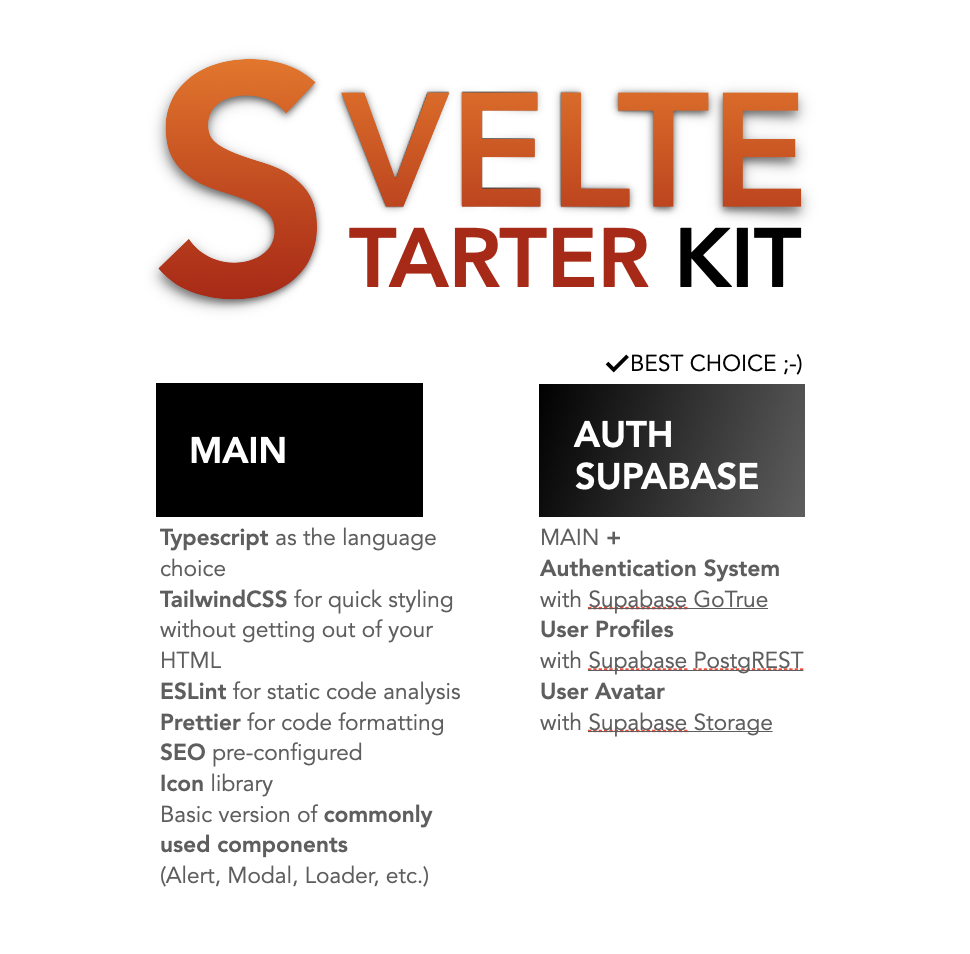

# Svelte Starter Kit
_Svelte Starter Kit_ is an opinionated boilerplate based off of [SvelteKit](https://kit.svelte.dev/), with all the bells and whistles you want ready, up and running when starting any Full-stack Svelte/Javascript project. Out of the box you get all the `essentials`
- __Typescript__ as the language choice
- __Tailwind CSS__ for quick styling without getting out of your HTML
- __ESLint__ and __Prettier__ for static code analysis and code formatting
- __SEO__ pre-configured

with [Supabase](https://supabase.io/) as the 3rd Party Persistence Layer for
- __Authentication System__ with Supabase GoTrue
- __User Profiles__ available on `/profile` as an example for Supabase PostgREST (CRUD API)
- __User Avatar__ which is Supbase Storage(AWS S3 backed effortless uploads) supported

and a huge bunch of pre-made, hand-rolled(easily replace-able) components, that you almost always end up installing/using for any non-trivial project
- __Alert/Toast__ to notify your users of the outcome of an event - `success, `error` or `default` is supported
- __Modal__(with multiple Modal and Sidepanel support) as you always come back to `em
- __Loaders__(two types) for reporting the progress of an API call + a page load
- __Popover__ for contextual menus
- __Form Helpers__ for basic input types, validation and submission


<!-- 
Boilerplate to quckly get up and running with Svelte + Supabase, with -->

__Note__: Refer the [basic](https://github.com/one-aalam/svelte-starter-kit/tree/basic) branch for a bare minimum starter structure with all the `essentials`

## How to Setup?
If new to Supabase
- Create account at [Supabase](https://app.supabase.io/)
- Create a Organisation, and a project

Once done, or if you already have a Supabase project
- Copy the generated project's API authentication details from `https://app.supabase.io/project/<your-awesome-svelte-project>/api/default?page=auth`
- Place the details in `.env`/`.env.local` as `VITE_SUPABASE_URL` and `VITE_SUPABASE_ANON_KEY`</li>
- Install NPM dependencies

Svelte Start Kit supports profile and user avatars now. To get the profile table and storage ready, execute the following query at `https://app.supabase.io/project/<your-awesome-svelte-project>/editor/sql`

```sql
-- Create a table for Public Profiles
create table profiles (
  id uuid references auth.users not null,
  username text unique,
  avatar_url text,
  website text,
  updated_at timestamp with time zone,

  primary key (id),
  unique(username),
  constraint username_length check (char_length(username) >= 3)
);

alter table profiles enable row level security;

create policy "Public profiles are viewable by everyone."
  on profiles for select
  using ( true );

create policy "Users can insert their own profile."
  on profiles for insert
  with check ( auth.uid() = id );

create policy "Users can update own profile."
  on profiles for update
  using ( auth.uid() = id );

-- Set up Storage!
insert into storage.buckets (id, name)
values ('avatars', 'avatars');

create policy "Avatar images are publicly accessible."
  on storage.objects for select
  using ( bucket_id = 'avatars' );

create policy "Anyone can upload an avatar."
  on storage.objects for insert
  with check ( bucket_id = 'avatars' );
```

`profiles` table's chnages are not observed in real-time due to performance reasons. If needed, execute the following query
```sql
begin;
  drop publication if exists supabase_realtime;
  create publication supabase_realtime;
commit;
alter publication supabase_realtime add table profiles;
```


and get started by running `yarn dev`

## Why SvelteKit?

Landing from a different Full-stack UI framework(Next.js, NuxtJS, Angular Universal)? Here's few essential watches and readings -
- [An update on SvelteKit](https://www.youtube.com/watch?v=fnr9XWvjJHw&t=19101s) (Rich Harris on SvelteKit - SvelteSummit)
- [A short history of Svelte](https://dev.to/ajcwebdev/a-short-history-of-sveltekit-49lk)

## Why Supabase?
- https://aalam.in/blog/supabase-the-open-source-firebase-alternative (Supabase has storage now, and something better than functions could land anytime soon)

## Building

Svelte Kit apps are built with _adapters_, which optimise your project for deployment to different environments.

By default, `yarn build` will generate a Node app that you can run with `node build`. To use a different adapter, add it to the `devDependencies` in `package.json` making sure to specify the version as `next` and update your `svelte.config.cjs` to [specify your chosen adapter](https://kit.svelte.dev/docs#configuration-adapter). The following official adapters are available:

- [@sveltejs/adapter-node](https://github.com/sveltejs/kit/tree/master/packages/adapter-node)
- [@sveltejs/adapter-static](https://github.com/sveltejs/kit/tree/master/packages/adapter-static)
- [@sveltejs/adapter-netlify](https://github.com/sveltejs/kit/tree/master/packages/adapter-netlify)
- [@sveltejs/adapter-vercel](https://github.com/sveltejs/kit/tree/master/packages/adapter-vercel)
- ...more soon

[See the adapter documentation for more detail](https://kit.svelte.dev/docs#adapters)
